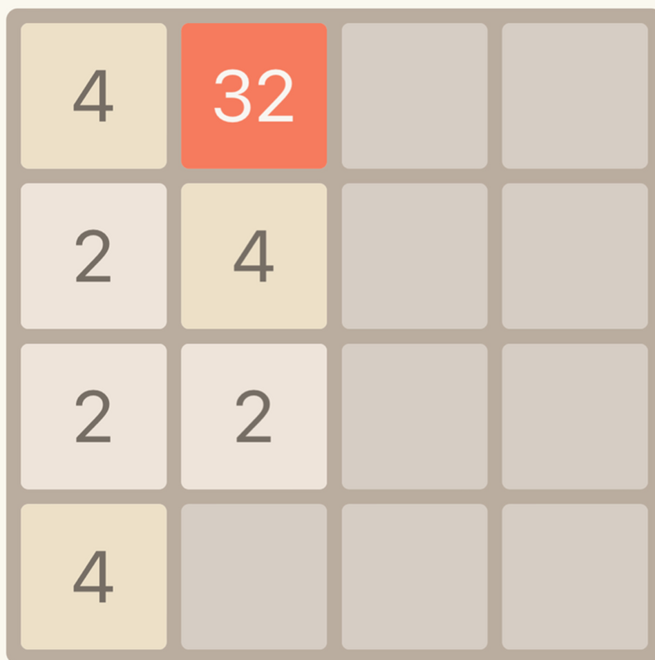
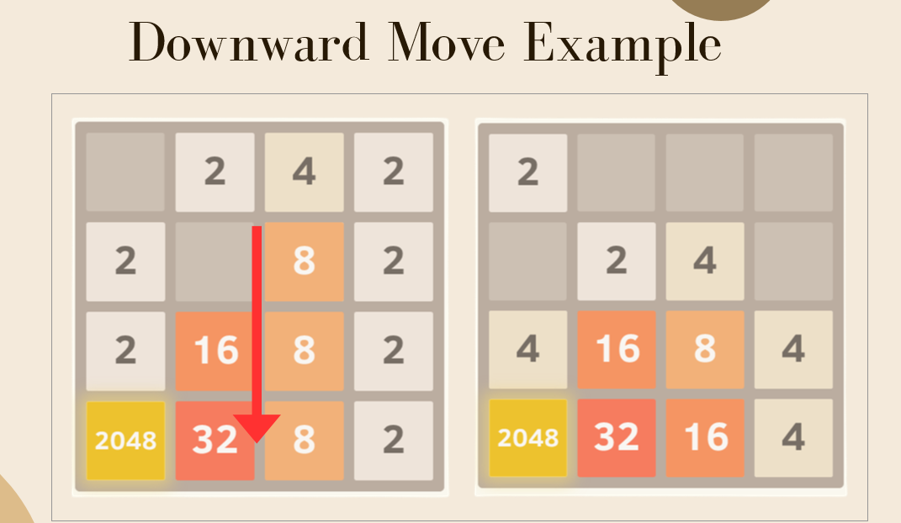
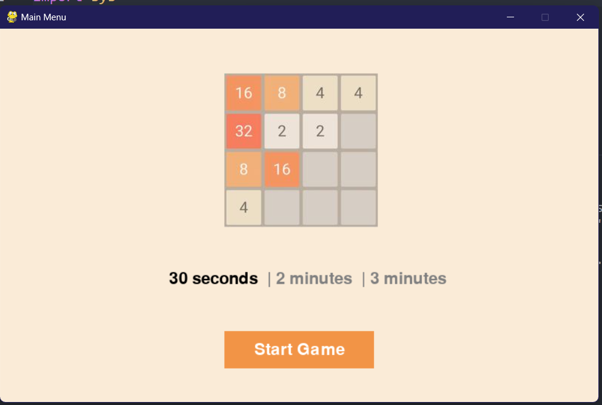
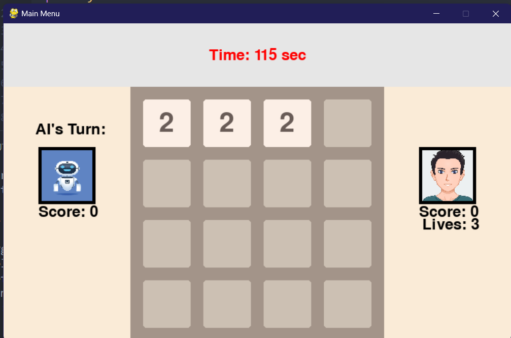

# 2048- Human vs AI
A python based game which where you can play 2048 game against AI.

## What is 2048?
- 4-by-4 square grid partially filled with tiles labeled with powers of 2.  
- Merge tiles with same number in order to create a tile as high possible
- Achieve higher scores and higher tiles and win the game.

## Human vs AI

- There will be 2 players. AI and User will take turn for their move within 3 second time limit.
- In each move, if two tiles is merged to higher tiles,  then that player will gain that point
- The game will have a time limit of 2 minutes.At the end of the game, the one with the most point will be the winner.

## AI Logic
- The AI use MinMax algorithm for deciding its next move.

## Main Menu

## Game Play

## Human Won

## AI Won
